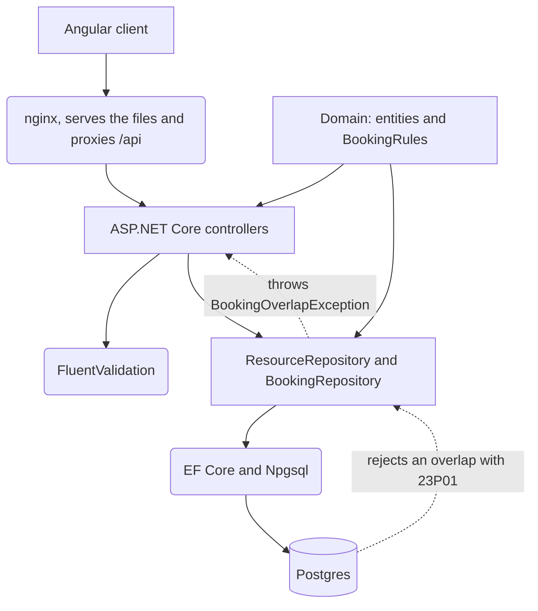

# atestat-resource-manager

[](https://github.com/V1c99/atestat-resource-manager/actions/workflows/ci.yml)

A booking service for the rooms, vehicles and equipment of a single organisation. The API is
ASP.NET Core and the client is Angular. Two confirmed bookings for the same resource cannot
overlap, and the database enforces that rule. This is a rebuild of my atestat project.


## The overlap rule

The rule is a Postgres exclusion constraint, added in
[a migration of its own](src/ResourceManager.Infrastructure/Migrations/20251203230500_NoOverlappingBookings.cs):

```sql
CREATE EXTENSION IF NOT EXISTS btree_gist;

ALTER TABLE bookings
ADD CONSTRAINT bookings_no_overlap
EXCLUDE USING gist (
    resource_id WITH =,
    tstzrange(starts_at, ends_at, '[)') WITH &&
)
WHERE (status = 'Confirmed');
```

No two rows may hold the same `resource_id` and a time range that overlaps. `btree_gist` provides
equality on a uuid, which GiST does not have on its own. The interval is half open, so a booking
ending at 11:00 and one starting at 11:00 do not overlap.
[`BookingRules.Overlaps`](src/ResourceManager.Domain/BookingRules.cs) states the same boundary in
C# and the unit tests pin it. The constraint is partial and applies only to confirmed rows, so a
cancellation frees the slot without deleting anything.

EF Core cannot model an exclusion constraint, so the migration is raw SQL. A violating insert
raises SQLSTATE 23P01. `BookingRepository` catches it and the controller returns 409 with the
booking that is in the way.


An integration test issues two overlapping requests at once and asserts that exactly one is
created and one is refused. The integration tests run against a real Postgres in Testcontainers,
because an in-memory provider does not carry the constraint.

## Running it

```bash
docker compose up
```

Postgres starts, both migrations are applied, and eight resources and four people are seeded. The
API is served on `http://localhost:5080` and the client on `http://localhost:8080`. OpenAPI is at
`http://localhost:5080/swagger`.

Without Compose:

```bash
dotnet build
dotnet test
```

Docker is still required for `dotnet test`, because the integration tests start their own
container. The unit tests alone do not need it:

```bash
dotnet test tests/ResourceManager.UnitTests
```

## API

| Endpoint | Purpose |
|---|---|
| `GET /api/resources` | all bookable resources, filtered by `type` and `includeInactive` |
| `GET /api/resources/{id}` | one resource |
| `POST /api/resources` | create a resource |
| `PUT /api/resources/{id}` | update name, location and capacity |
| `POST /api/resources/{id}/deactivate` | withdraw a resource from use |
| `POST /api/resources/{id}/activate` | return it to use |
| `GET /api/resources/{id}/schedule?from=&to=` | confirmed bookings in a window |
| `GET /api/bookings` | filtered by resource, window and status |
| `GET /api/bookings/{id}` | one booking |
| `POST /api/bookings` | 201, or 409 with the conflicting booking |
| `POST /api/bookings/{id}/cancel` | frees the slot and writes an audit row |
| `GET /api/bookings/{id}/audit` | status changes, oldest first |
| `GET /api/users` | the people who can book |

## Architecture



`ResourceManager.Domain` holds the entities and `BookingRules` and references nothing, which is
why the unit tests run without Docker. `ResourceManager.Infrastructure` holds the `DbContext`, the
two migrations and the repositories. `ResourceManager.Api` holds the controllers, the request and
response types, the validators and the mapping.

## Limitations

There is no authentication. A request states who is booking and the server accepts it.

A booking is confirmed when it is created and can only be cancelled afterwards. There is no
approval step and no notification.

The audit table is append only by convention. The application only inserts into it, but the
database does not prevent an update or a delete.

Times are stored in UTC and rendered in the browser's timezone. There is no per organisation
timezone.

## Numbers

| Measurement | Value |
|---|---|
| Tests | 39 |
| Unit tests, no database | 11 |
| Integration tests, on a real Postgres | 28 |
| Line coverage | 96.22% |
| Branch coverage | 80.00% |
| Migrations | 2 |
| Endpoints | 13 |
| Projects in the solution | 5 |

Coverage is measured with coverlet over both test projects, with the generated migration files
excluded through `coverlet.runsettings`:

```bash
dotnet test --collect:"XPlat Code Coverage" --settings coverlet.runsettings
```

## Decisions

1. [Postgres instead of SQL Server](docs/adr/0001-postgres-instead-of-sql-server.md)
2. [The database decides if two bookings clash](docs/adr/0002-the-database-decides-if-two-bookings-clash.md)
3. [Mapping written by hand](docs/adr/0003-mapping-written-by-hand.md)
4. [No message broker](docs/adr/0004-no-message-broker.md)

## Stack

| | |
|---|---|
| Language | C# 12 on .NET 8 |
| API | ASP.NET Core, controllers |
| Data | EF Core 8, Npgsql, PostgreSQL 17 |
| Validation | FluentValidation |
| Logging | Serilog, JSON to the console |
| Docs | Swashbuckle, OpenAPI at `/swagger` |
| Tests | xUnit, FluentAssertions, Testcontainers |
| Client | Angular 20, standalone components and signals |
| CI | GitHub Actions, build, test, then both images |
