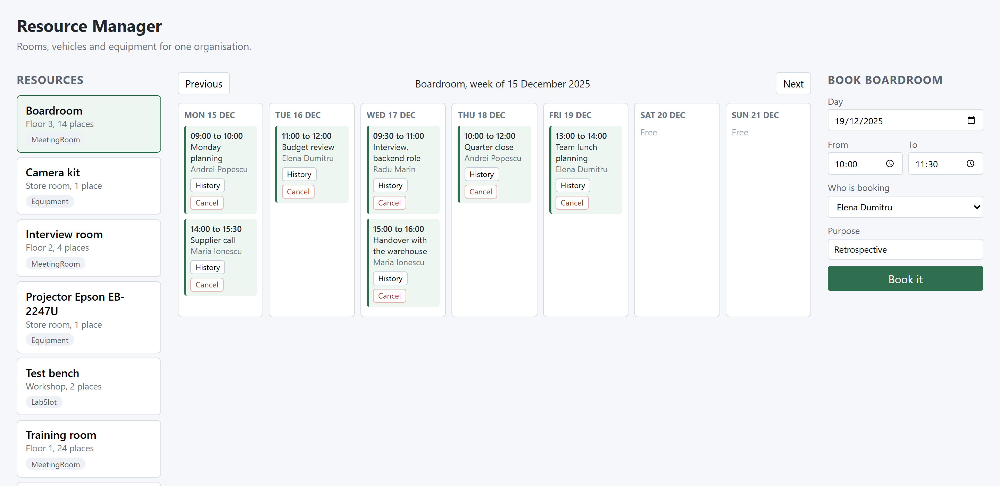
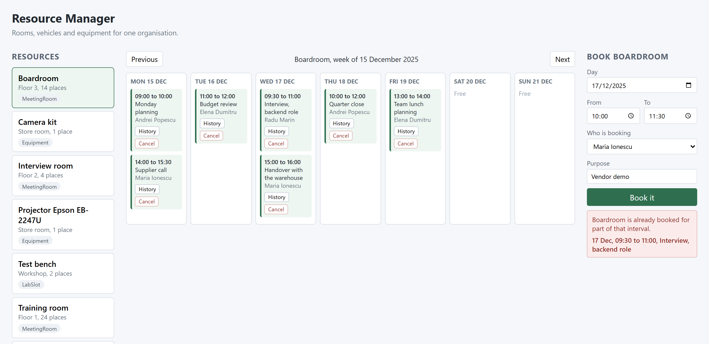
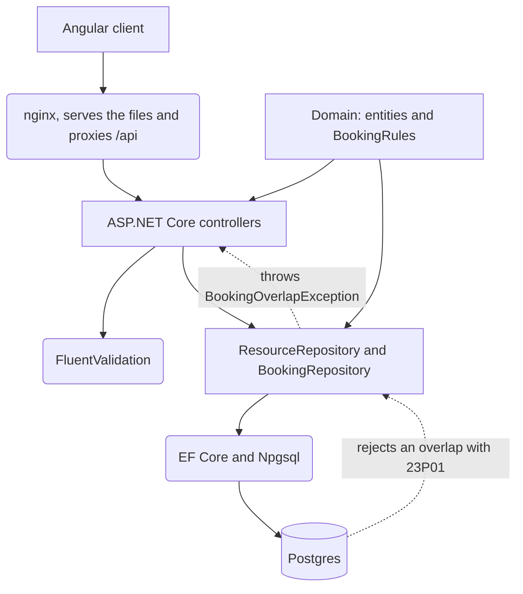

# atestat-resource-manager

[](https://github.com/V1c99/atestat-resource-manager/actions/workflows/ci.yml)

An ASP.NET Core service for booking the rooms, vehicles and equipment of one organisation, with
an Angular client on top of it. Two confirmed bookings for the same resource can never overlap,
and the thing that guarantees it is a Postgres exclusion constraint rather than a check written
in my code.



I built the first version of this in 2024 as my *atestat*, the Romanian state examination in
informatics at the end of high school. This repository is the same problem built again during my
first year at university. [What the original was, and what I got wrong in
it](docs/original-project.md).

## What this is not

**It is not the 2024 code, and the marks from that examination do not belong to it.** The
original was written in C# on Windows frameworks over a SQL database, it was defended in front
of a committee, and it is not published. This is a reconstruction of the same idea with what I
have learned since.

**There is no authentication.** A request says who is booking and the server believes it. There
is a `users` table and every booking carries an id from it, and that is all. I have not learned
how to hold a session safely yet and I did not want to fake it. Anything real needs a login in
front of this.

**A booking is confirmed the moment it is made.** The only other thing that can happen to it is
being cancelled. There is no approval step, no weekly repeat, and no email to the person whose
room was taken away. A real system would want all three.

**The audit table is append only by convention.** The application only ever inserts into
`booking_audits`, but nothing in the database stops an update or a delete. Making it a real
guarantee needs a trigger and a second database role.

**Everything is stored in UTC and rendered in the browser's timezone.** The API always answers
with an offset of zero and the client turns it into local time. There is no per organisation
timezone, so an organisation spread over two of them would be wrong.

## Two people booking the same room at the same time

This is the whole point of the repository, so it gets the longest section.

My first version checked for a clash the obvious way, with a query before the insert:

```csharp
var nearby = await _db.Bookings
    .Where(b => b.ResourceId == booking.ResourceId
        && b.Status == BookingStatus.Confirmed
        && b.StartsAt > from
        && b.StartsAt < to)
    .ToListAsync();

return nearby.Any(existing => BookingRules.Overlaps(existing, booking));
```

That is a read, and then a write, with nothing holding the room in between. Two requests that
arrive together both run the query, both see a free room, and both insert. The 2024 project had
exactly this bug and nobody at the defence asked about it.

So the rule lives in the schema instead, in
[a migration of its own](src/ResourceManager.Infrastructure/Migrations/20251203230500_NoOverlappingBookings.cs):

```sql
CREATE EXTENSION IF NOT EXISTS btree_gist;

ALTER TABLE bookings
ADD CONSTRAINT bookings_no_overlap
EXCLUDE USING gist (
    resource_id WITH =,
    tstzrange(starts_at, ends_at, '[)') WITH &&
)
WHERE (status = 'Confirmed');
```

Read it as: no two rows may have the same `resource_id` and time ranges that overlap. Three
details in there took me longer than the rest of the project.

`btree_gist` has to be installed first. GiST handles ranges out of the box but not equality on a
uuid, and the migration failed on a clean database until I added that line.

`[)` is a half-open interval, so the range includes its start and excludes its end. A booking
from 10:00 to 11:00 and one from 11:00 to 12:00 do not overlap, which is what anyone booking a
room expects. Before I understood the notation I had `[]` and the second booking was refused.
[`BookingRules.Overlaps`](src/ResourceManager.Domain/BookingRules.cs) says the same thing in C#
and the unit tests pin the boundary.

The `WHERE` makes the constraint partial. It only applies to confirmed rows, so cancelling a
booking frees the slot at once, without deleting anything and without the audit trail losing the
history.

EF Core cannot model an exclusion constraint, so that migration is raw SQL and the model snapshot
does not know the constraint is there. The insert throws instead of returning a flag, so
`BookingRepository` catches SQLSTATE 23P01 and the controller turns it into a 409 that names the
booking already in the way:



The test that proves it fires both requests at once and asserts that exactly one of them wins:

```csharp
[Fact]
public async Task Concurrent_overlapping_bookings_only_one_succeeds()
{
    var resource = await TestData.CreateResourceAsync(_client);
    var day = TestData.NextMonday(10);

    var first = _client.PostAsJsonAsync("/api/bookings", TestData.Booking(resource.Id, day, day.AddHours(1)), ApiFactory.Json);
    var second = _client.PostAsJsonAsync("/api/bookings", TestData.Booking(resource.Id, day.AddMinutes(30), day.AddMinutes(90), TestData.OtherRequester), ApiFactory.Json);

    var results = await Task.WhenAll(first, second);

    results.Count(r => r.StatusCode == HttpStatusCode.Created).Should().Be(1);
    results.Count(r => r.StatusCode == HttpStatusCode.Conflict).Should().Be(1);
}
```

It runs against a real Postgres in Testcontainers rather than an in-memory provider, because an
in-memory provider does not have the constraint and would pass while proving nothing.

## What changed since 2024

| Then | Now | Why |
|---|---|---|
| Overlap checked in application code | Postgres exclusion constraint over `tstzrange` | The original had a race. Two people could both be told the room was free |
| Windows only desktop frameworks | ASP.NET Core in a container | `docker compose up` replaces the page of setup instructions I wrote for the defence |
| Clicked through it the night before | 39 tests, 28 of them against a real Postgres | I could not have changed the original safely, and by the defence I was afraid to |
| Connection string in the source | Environment variables, and a `.env.example` | It sat in the file, and in the documentation I handed in |
| One `CREATE TABLE` script | EF Core migrations | The schema has a history now, and the constraint arrives in a migration of its own |

Being specific about what was wrong is the point of doing this again. The interesting part was
not writing it a second time, it was finding out what my eighteen year old self had not thought
about.

## Running it

```bash
docker compose up
```

That starts Postgres, applies both migrations, seeds eight resources and four people, and serves
the API on `http://localhost:5080` and the client on `http://localhost:8080`. Swagger is at
`http://localhost:5080/swagger`.

In the containers the client reaches the API through nginx on the same origin, so nothing has to
be configured for the two of them to find each other.

## The API

| | |
|---|---|
| `GET /api/resources` | everything bookable, filtered by `type` and `includeInactive` |
| `GET /api/resources/{id}` | one of them |
| `POST /api/resources` | add one |
| `PUT /api/resources/{id}` | rename it, move it, change its capacity |
| `POST /api/resources/{id}/deactivate` | take it out of use without deleting it |
| `POST /api/resources/{id}/activate` | put it back |
| `GET /api/resources/{id}/schedule?from=&to=` | the confirmed bookings in a window |
| `GET /api/bookings` | filtered by resource, window and status |
| `GET /api/bookings/{id}` | one booking |
| `POST /api/bookings` | 201, or 409 with the booking that is in the way |
| `POST /api/bookings/{id}/cancel` | frees the slot and writes an audit row |
| `GET /api/bookings/{id}/audit` | every status change, oldest first |
| `GET /api/users` | the people who can book |

## Architecture



`ResourceManager.Domain` holds the entities and `BookingRules` and references nothing at all. No
EF Core, no Npgsql, no ASP.NET. That is why the unit tests run without Docker.

`ResourceManager.Infrastructure` holds the `DbContext`, the two migrations and the repositories.
The repositories are concrete classes with no interface above them, because there is exactly one
implementation and the tests run against a real database rather than a double.

`ResourceManager.Api` holds the controllers, the request and response types, the validators and
the mapping. The mapping is written by hand, for the reason in
[ADR 3](docs/adr/0003-mapping-written-by-hand.md).

## The numbers

| Measurement | Value |
|---|---|
| Tests | 39 |
| Unit tests, no database | 11 |
| Integration tests, on a real Postgres | 28 |
| Line coverage | 96.22% |
| Branch coverage | 80.00% |
| Migrations | 2 |
| Endpoints | 13 |
| Projects in the solution | 5 |

Coverage is measured with coverlet over both test projects, with the generated migration files
excluded through `coverlet.runsettings`:

```bash
dotnet test --collect:"XPlat Code Coverage" --settings coverlet.runsettings
```

## Decisions

1. [Postgres instead of SQL Server](docs/adr/0001-postgres-instead-of-sql-server.md)
2. [The database decides if two bookings clash](docs/adr/0002-the-database-decides-if-two-bookings-clash.md)
3. [Mapping written by hand](docs/adr/0003-mapping-written-by-hand.md)
4. [No message broker](docs/adr/0004-no-message-broker.md)

## Building it without Compose

```bash
dotnet build
dotnet test
```

Docker still has to be running for the second one, because the integration tests start their own
Postgres container. The unit tests do not need it:

```bash
dotnet test tests/ResourceManager.UnitTests
```

To run the API against a database of your own, set the connection string as an environment
variable rather than editing `appsettings.json`:

```bash
export ConnectionStrings__Database="Host=localhost;Port=5432;Database=resourcemanager;Username=resourcemanager;Password=..."
dotnet run --project src/ResourceManager.Api
```

The client in development calls `http://localhost:5080/api` directly, which is the reason the API
allows `http://localhost:4200` as an origin:

```bash
cd client
npm install
npm start
```

## Stack

| | |
|---|---|
| Language | C# 12 on .NET 8 |
| API | ASP.NET Core, controllers |
| Data | EF Core 8, Npgsql, PostgreSQL 17 |
| Validation | FluentValidation |
| Logging | Serilog, JSON to the console |
| Docs | Swashbuckle, OpenAPI at `/swagger` |
| Tests | xUnit, FluentAssertions, Testcontainers |
| Client | Angular 20, standalone components and signals |
| CI | GitHub Actions, build, test, then both images |
